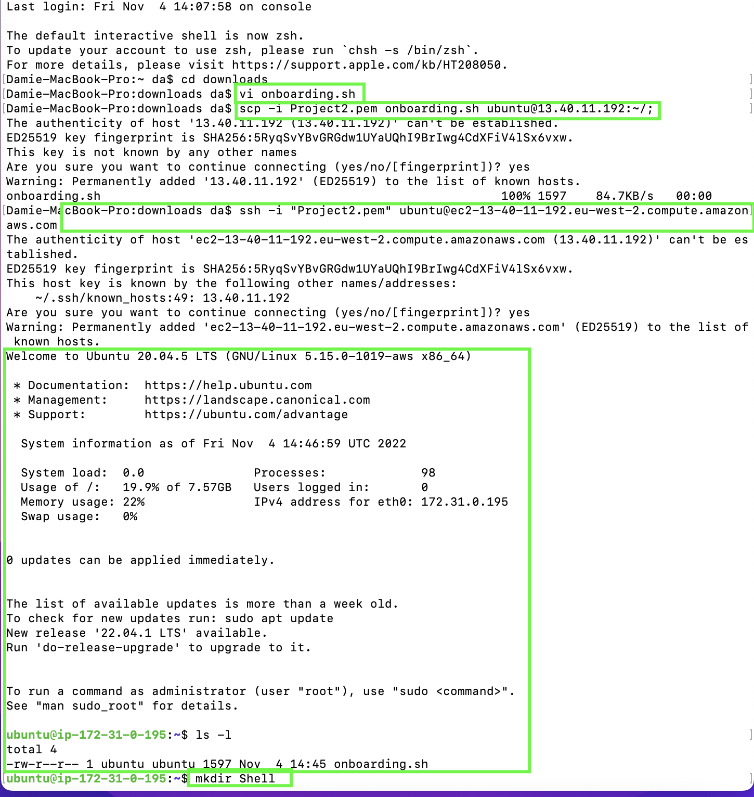
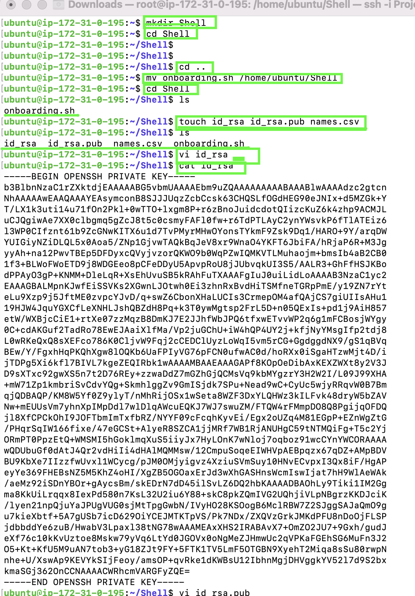
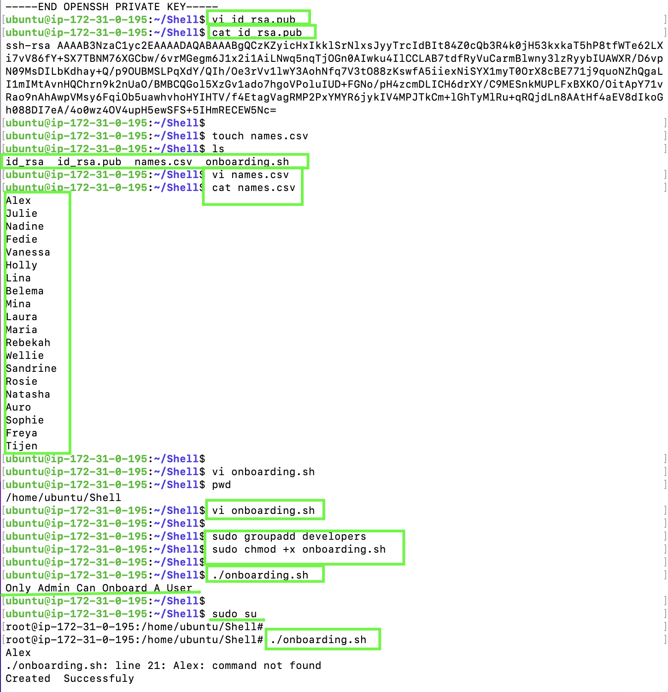
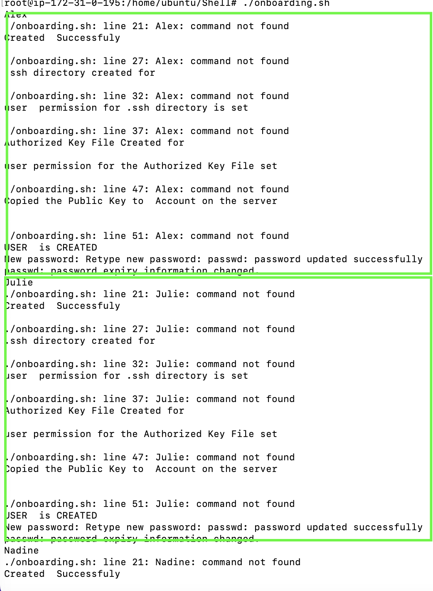
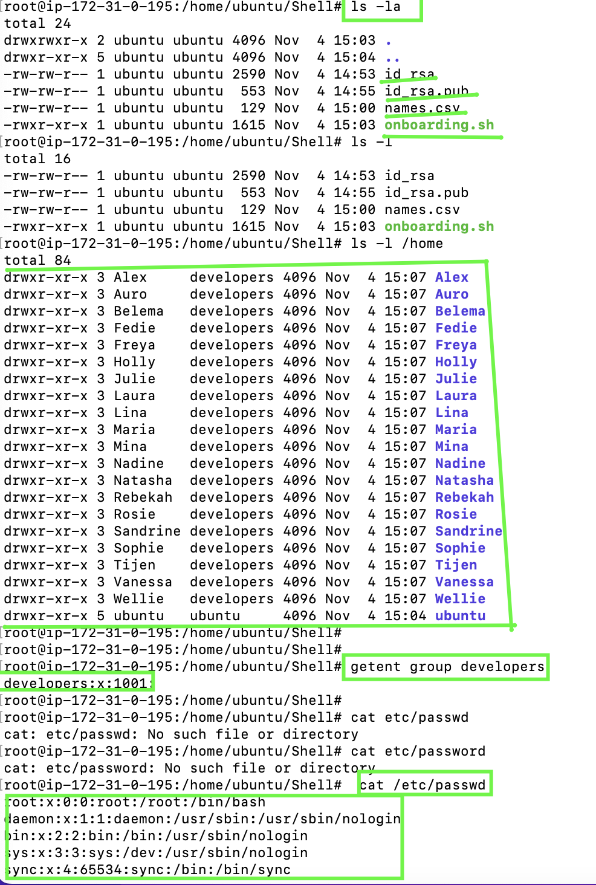
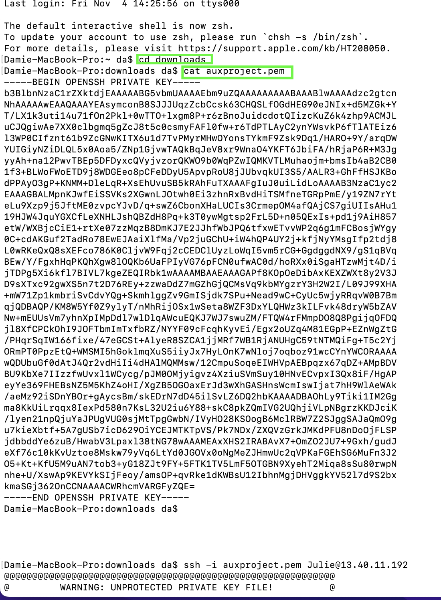
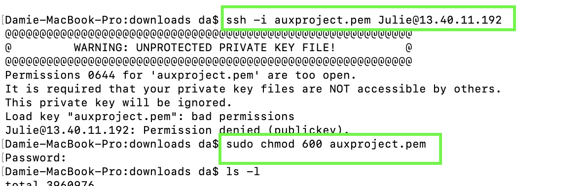
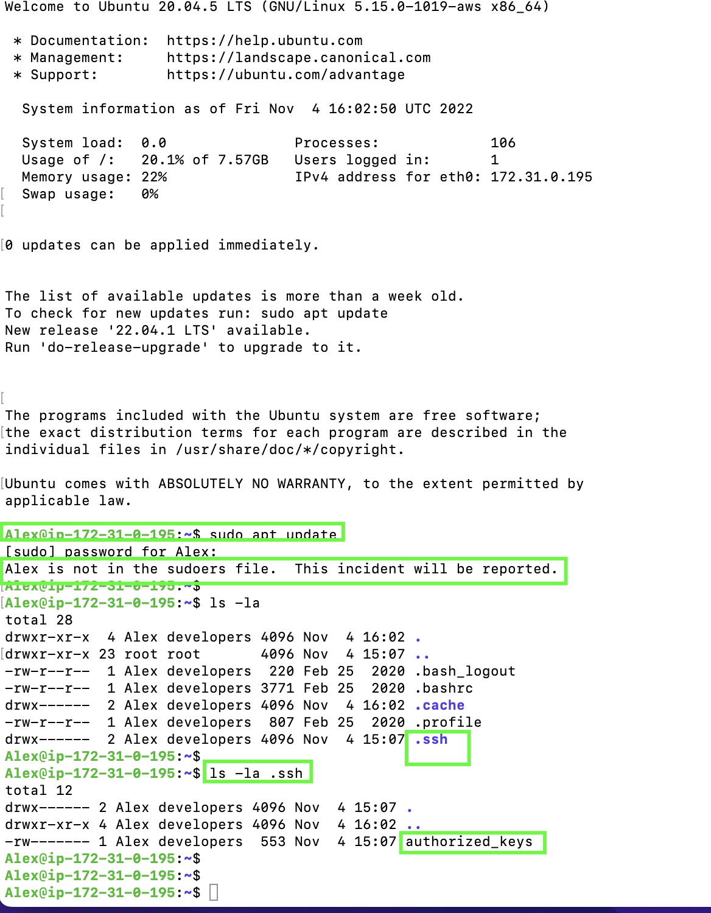
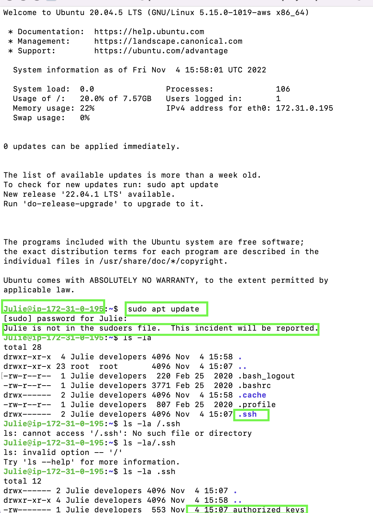

## AUXILLARY PROJECT : SHELL SCRIPTING

## The task is to :

>- Onboarding 20 New Linux Users onto a Server

>- Created a Shell Script that Reads a `csv` file with the first names of the the users to be onboarded

**Steps** - Connected to AWS server using Ubuntu 20.04.5 LTS-  

     - Uploaded my script (Onboarding.sh) within my Ubuntu server 

     - Connected to AWS server using Ubuntu

     - Created the project folder : Shell - mkdir Shell

     - Navigated into Shell folder  - cd Shell

     - Moved my sript onboarding.sh into my Shell folder - mv onboarding.sh 

     - Created a csv file named : names.csv - touch names.csv

     - Open the names.csv file and inserted the 20 first names of new users- vim names.csv

    - Created file  id_rsa  - touch id-rsa

    - Opened and pasted in id-rsa file the private key - vi id_rsa

    - Created id_rsa.pub file - touch id_rsa.pub

    - Opened and pasted in id_rsa.pub file the public key  - vi id_rsa.pub

    - Created the Group developers -  sudo groupadd developers

    - Made the script onboarding.sh executable - sudo chmod +x onboarding.sh

    - Switched to super user - sudo su

    - Run the script onboarding.sh  - ./onboarding.sh

    - Verify the New Users -  cd ../..
   
    
    - ls -la 

    - Confimation of new users and in developers group -  getent group developers

  

     - Opened a New window terminal and created new access key - touch auxproject.pem
      
      - Pasted the private key in auxproject.pem  - vi auxproject.pem

    - Remotely log into the new users - ssh -i auxproject.pem (newuser) @public ip address

