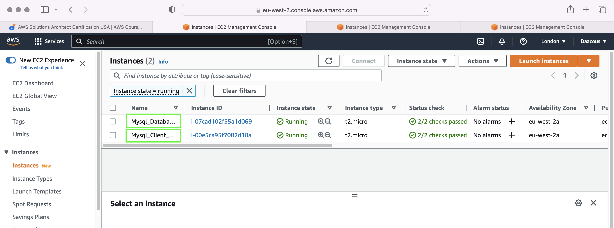
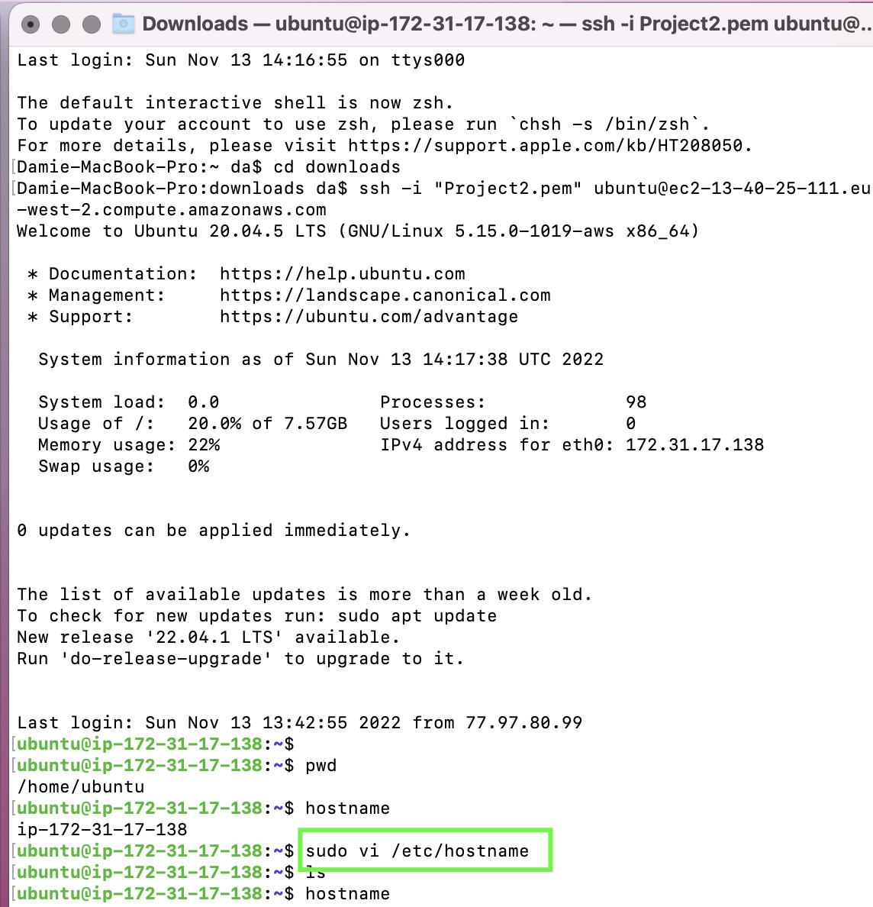
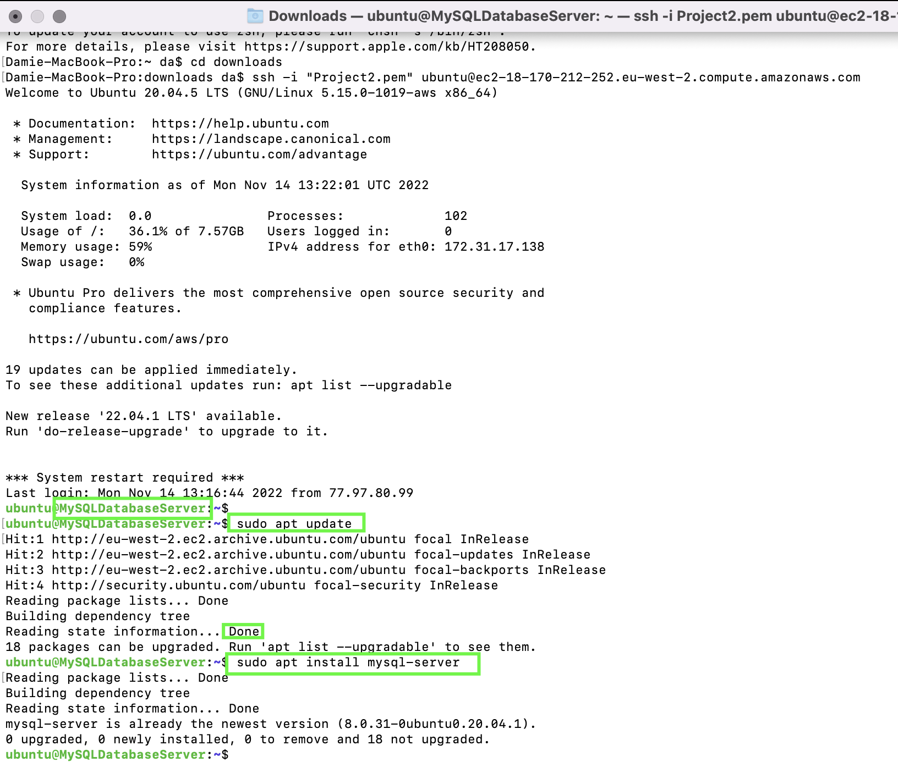
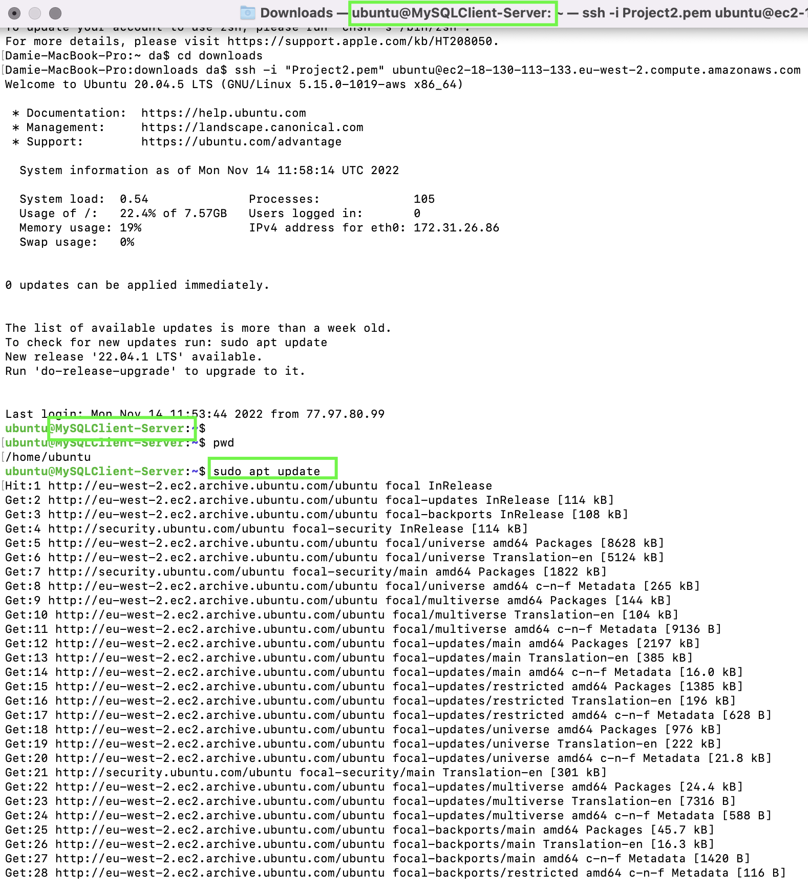
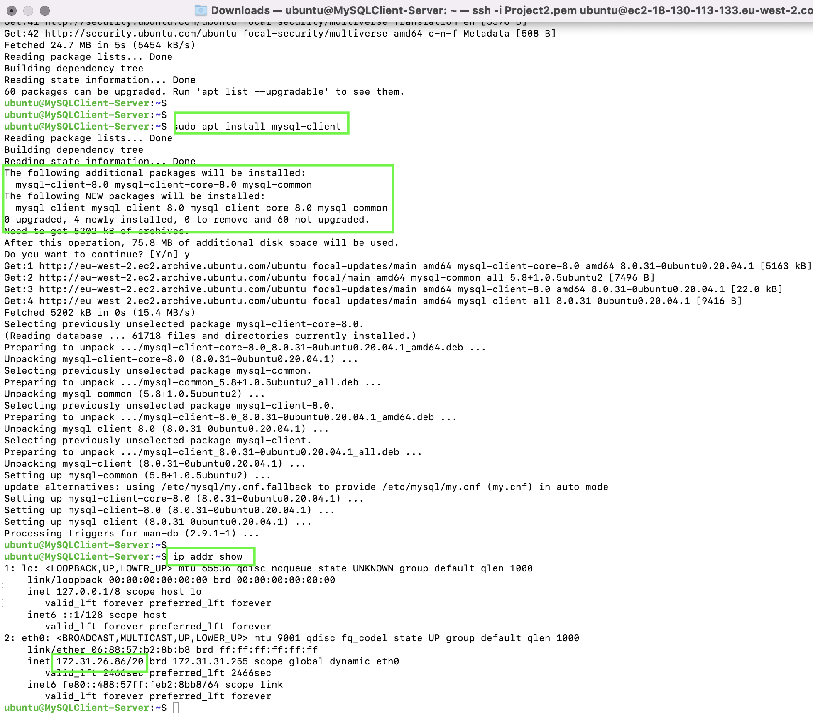
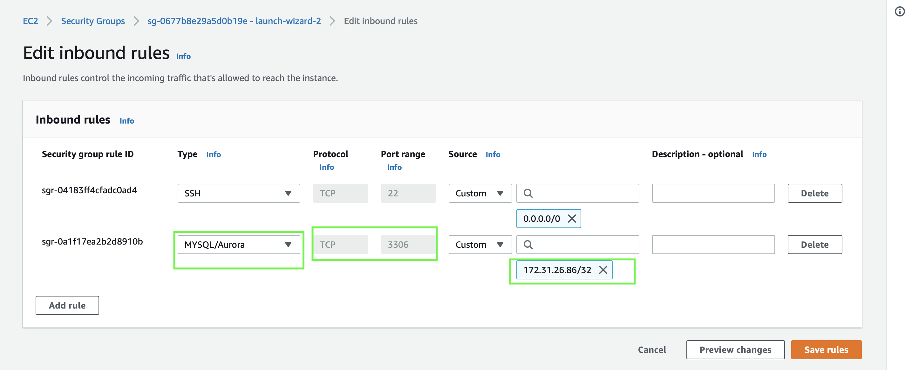
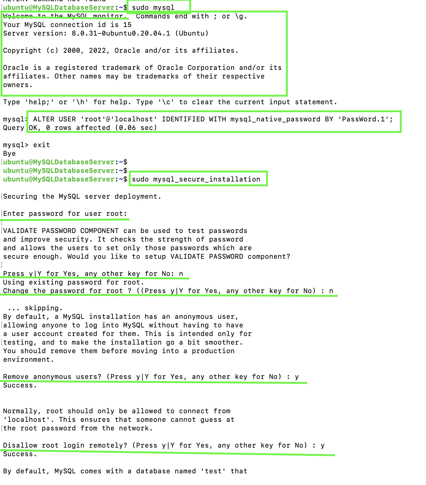
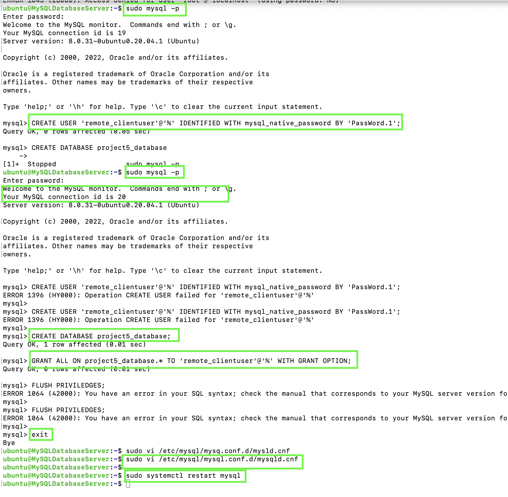
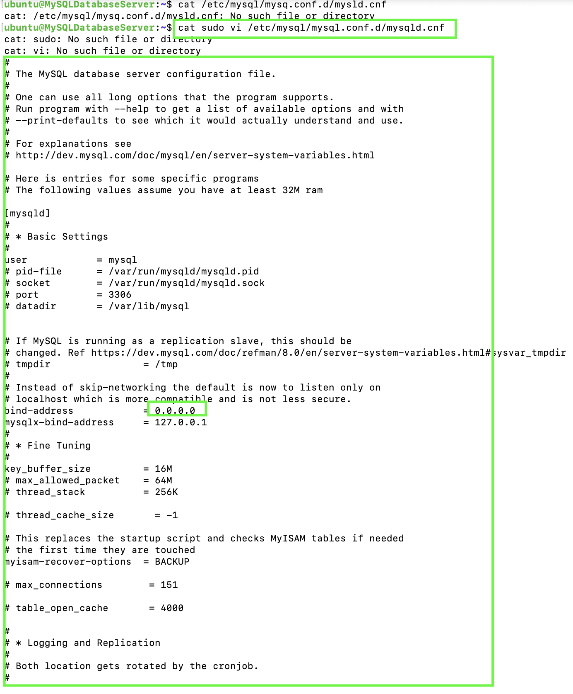

## CLIENT-SERVER ARCHITECTURE USING A MYSQL RELATIONAL DATABASE MANAGEMENT SYSTEM

## Understanding Client-Server Architecture

## Client-Server refers to an architecture in which two or more computers are connected together over a network to send and receive requests between one another

## TASK - Implementing a Client Server Architecture using MySQL Database Management System (DBMS).

*Step 1 - Created and configured two Linux based virtual servers in AWS using Ubuntu 20.04 LTS*

   Server A - Mysql_database_server

   Server B - Mysql_client_server

*Step 2 - On Mysql_database-server terminal*  ran command : 

 
   sudo vi /etc/hostname

To change Hostname - 

  
  
   sudo apt update

to update server.

Then install MYSQL Server software -  

   sudo apt install mysql-server 

*Step 3 - On Mysql_client_server terminal* ran command: 

  sudo vi /etc/hostname

To change Hostname - 

   sudo apt update

to update server

then install MYSQL client software - 

  sudo apt install mysql-client 

*Step 4 - on Mysql_database-server, created a new entry in the security group by connecting from the Mysql_client_server through Port TCP 3306*

*Step 5 - on the MYSQL_databaseserver ran command 

  sudo mysql

Then ran command to run security script that comes pre-installed with MYSQL which will remove insecure default settings

   ALTER USER 'root'@'localhost' IDENTIFIED WITH mysql_native_password BY 'PassWord.1';

   sudo mysql_secure_installation

 

Created user database on MySQL and permissions

  
   CREATED USER 'remote-clientuser'@'%' IDENTIFIED WITH mysql_native_password BY 'PassWord.1';

   CREATE DATABASE project5_database;

   GRANT ALL ON project5_database.*  TO 'remote-clientuser'@'%' WITH GRANT OPTION;

   sudo mysql -p

*Step 6 - configured MySQL to allow connections from remote hosts iwth command* 

  
   sudo vi /etc/mysql/mysql.conf.d/mysqld.cnf

  
   sudo systemctl restart mysql

Replaced '127.0.0.1' to '0.0.0.0.0' in MySQL config file  to connect to MySQL_client server

*Step 6 - Connected MySQL_databaseserver remotely to MySQL_clientserver in theMySQL utility*

*Proof of succefully connecting remote MySQL server and peforming queries by "showing databases"*

