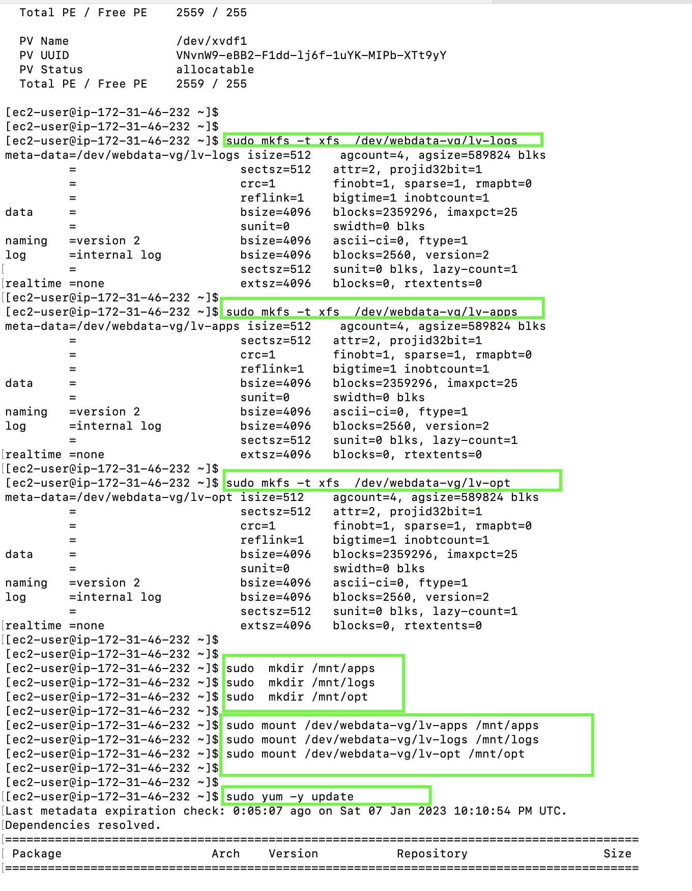
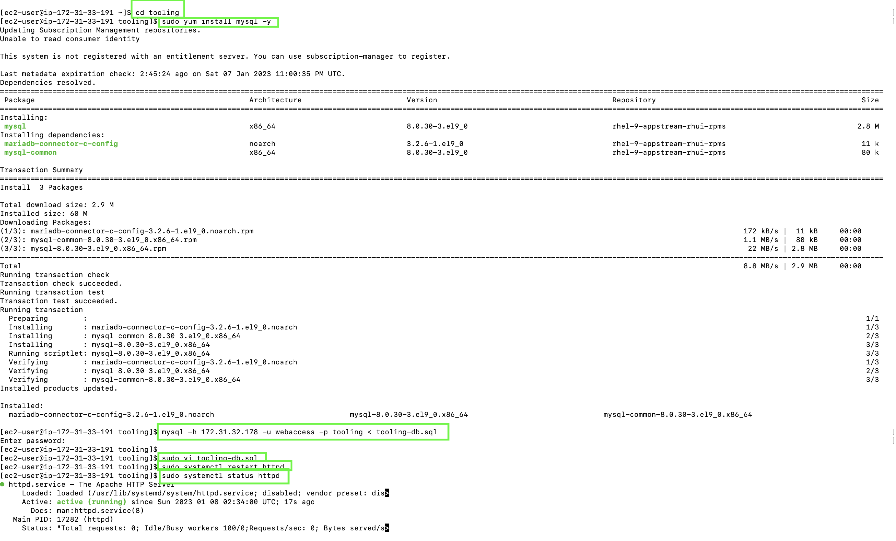

## DEVOPS TOOLING WEBSITE SOLUTION

## In this project I will implement a solution that consists of the following components:

- Infrastructure: AWS
- Webserver Linux: Red Hat Enterprise Linux 9
- Database Server: Ubuntu 20.04 + MySQL
- Storage Server: Red Hat Enterprise Linux 9 + NFS Server
- Programming Language: PHP
- Code Repository: GitHub

On the diagram below you will see a common pattern where several stateless Web Servers share a common database and also access the same files using Network File Sytem (NFS) as a shared file storage. Even though the NFS server might be located on a completely separate hardware – for Web Servers it look like a local file system from where they can serve the same files.

STEP 1 – PREPARED NFS SERVER

- Spinned up a new EC2 instance with RHEL Linux 9 Operating 
System.

- Configured Logical Volume Management (LVM) on the Server.

- Formatted the disks as xfs

Created 3 Logical Volumes:

- lv-opt 
- lv-apps, and 
- lv-logs

Created mount points on /mnt directory for the logical volumes as follow:
- Mounted lv-apps on /mnt/apps – To be used by webservers
- Mount lv-logs on  /mnt/logs – To be used by webserver logs
- Mount lv-opt on  /mnt/opt – To be used by Jenkins server

 - *Install NFS server and configured it to start on reboot and make sure it was up and running*

       sudo yum -y update
       sudo yum install nfs-utils -y
       sudo systemctl start nfs-server.service
       sudo systemctl enable nfs-server.service
       sudo systemctl status nfs-server.service

 - Exported the mounts for webservers’ `subnet cidr` to connect as clients.     

 

 - Set up permission to allow the Web servers to read, write and execute files on NFS:

       sudo chown -R nobody: /mnt/apps
       sudo chown -R nobody: /mnt/logs
       sudo chown -R nobody: /mnt/opt

       sudo chmod -R 777 /mnt/apps
       sudo chmod -R 777 /mnt/logs
       sudo chmod -R 777 /mnt/opt

       sudo systemctl restart nfs-server.service

*Configured access to NFS for clients within the same subnet*

    sudo vi /etc/exports

    /mnt/apps <Subnet-CIDR>(rw,sync,no_all_squash,no_root_squash)
    /mnt/logs <Subnet-CIDR>(rw,sync,no_all_squash,no_root_squash)
    /mnt/opt <Subnet-CIDR>(rw,sync,no_all_squash,no_root_squash)

    sudo exportfs -arv

    rpcinfo -p | grep nfs

## STEP 2 — CONFIGURED THE DATABASE SERVER

- Install MySQL server
Create a database and name it tooling
- Created a database user and named it webaccess
- Granted permission to webaccess user on tooling database to do anything only from the webservers `subnet cidr`

## STEP 3 - PREPARED THE WEB SERVERS

- Configured NFS client
- Deploy a Tooling application to the Web Servers into a shared NFS folder
- Configured the Web Servers to work with a single MySQL database

- Installed  NFS client

      sudo yum install nfs-utils nfs4-acl-tools -y
      
- Mounted */var/www/* and targeted the NFS server’s export for apps
     
      sudo mkdir /var/www
    
      sudo mount -t nfs -o rw,nosuid <NFS-Server-Private-IP-Address>:/mnt/apps /var/www

Verified that NFS was mounted successfully by running *df -h*. 
         
    sudo vi /etc/fstab

    <NFS-Server-Private-IP-Address>:/mnt/apps /var/www nfs defaults 0 0

## Install Remi’s repository, Apache and PHP

 
 
    sudo yum install httpd -y

    sudo dnf install https://dl.fedoraproject.org/pub/epel/epel-release-latest-8.noarch.rpm

    sudo dnf install dnf-utils http://rpms.remirepo.net/enterprise/remi-release-8.rpm

    sudo dnf module reset php

    sudo dnf module enable php:remi-7.4

    sudo dnf install php php-opcache php-gd php-curl php-mysqlnd

    sudo systemctl start php-fpm

    sudo systemctl enable php-fpm

    sudo setsebool -P httpd_execmem 1

## Repeated same steps for another 2 Web Servers

 

 

  

- Verified that Apache files and directories are available on the Web Server in /var/www and also on the NFS server in /mnt/apps.

 

- Apache logs folder 

  

- Forked the tooling source code from Darey.io Github account

 

    sudo vi /etc/sysconfig/selinux 
    
 set     SELINUX=disabledthen restrt httpd.

- Updated the website’s configuration to connect to the database
 via */var/www/html/functions*.php file)*. Applied *tooling-db.sql* script* to the database.

 

 

 

 

 