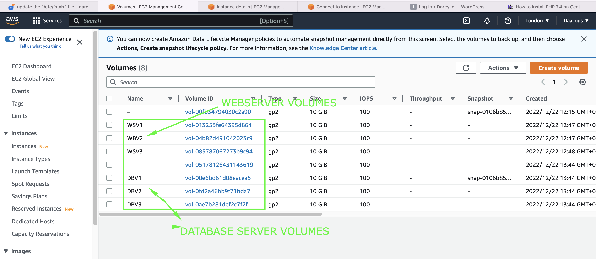
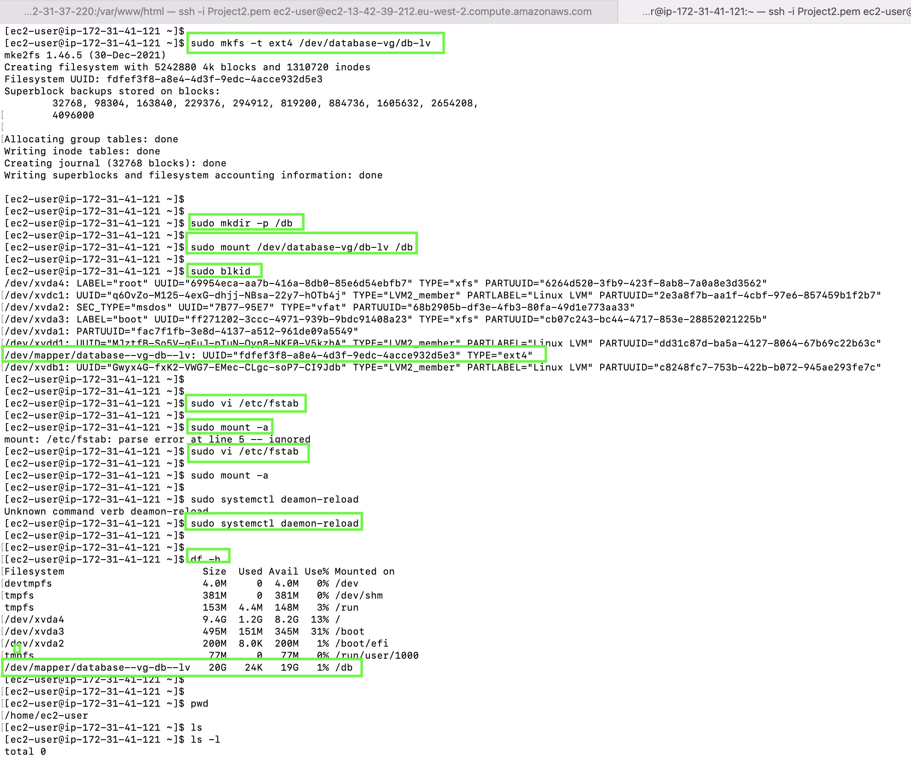

# WEB SOLUTION WITH WORDPRESS

## In this project I will prepare storage infrastructure on two Linux servers and implement a basic web solution using WordPress. 

WordPress is a free and open-source content management system written in PHP and paired with MySQL or MariaDB as its backend Relational Database Management System (RDBMS).

## This Project consist of 2 parts: 

> - Configuration of storage subsystem for Web and Database servers based on Linux OS. 

> - Installation of WordPress and connection  to a remote MySQL database server. 

Step 1 : 

- Launched an EC2 Redhat OS  instance that will serve as "Web Server". 
- Created 3 volumes in the same Availability zone as the Web Server EC2, each of 10 GiB.

- Attached all three volumes one by one to the Web Server EC2 instance

- Open up the Linux terminal to begin configuration
- Used *lsblk* command to inspect what block devices are attached to the server. 

- Used df -h command to see all mounts and free space on your server
- Used gdisk utility to create a single partition on each of the 3 disks

      sudo gdisk /dev/xvdf

  
    

      sudo gdisk /dev/xvdg

   

      sudo gdisk /dev/xvdh

Used *lsblk* utility to view the newly configured partition on each of the 3 disks

- Installed *lvm2* package using *sudo yum install lvm2*. 

- Run *sudo lvmdiskscan* command to check for available 
partitions.

Use pvcreate utility to mark each of 3 disks as physical volumes (PVs) to be used by 
LVM

     sudo pvcreate /dev/xvdf1 xvdg1 xvdh1

     sudo pvs

Used vgcreate utility to add all 3 PVs to a volume group (VG). Name the *VG webdata-vg*

    sudo vgs

 - Used lvcreate utility to create 2 logical volumes. apps-lv (Used half of the PV size), and logs-lv Use the remaining space of the PV size. NOTE: apps-lv will be used to store data for the Website while, logs-lv will be used to store data for logs.

       sudo lvcreate -n apps-lv -L 14G webdata-vg

       sudo lvcreate -n logs-lv -L 14G webdata-vg

       sudo lvs

       sudo vgdisplay -v #view complete setup - VG, PV, and LV
       
       sudo lsblk 

 Used *mkfs.ext4* to format the logical volumes with ext4 filesystem   

    sudo mkfs -t ext4 /dev/webdata-vg/apps-lv
    sudo mkfs -t ext4 /dev/webdata-vg/logs-lv

 - Created */var/www/html* directory to store website files

       sudo mkdir -p /var/www/html

  - Create /home/recovery/logs to store backup of log data

        sudo mkdir -p /home/recovery/logs    

 Mount */var/www/html* on *apps-lv* logical volume        

    sudo mount /dev/webdata-vg/apps-lv /var/www/html/

 Used rsync utility to backup all the files in the log directory /var/log into /home/recovery/logs (This is required before mounting the file system)

    sudo rsync -av /var/log/. /home/recovery/logs/

 Mount */var/log on logs-lv* logical volume. 

    sudo mount /dev/webdata-vg/logs-lv /var/log

 Restore log files back into */var/log* directory   

    sudo rsync -av /home/recovery/logs/. /var/log

 - Update */etc/fstab* file so that the mount configuration will persist after restart of the server.

       sudo blkd

       sudo vi /etc/fstab

 - Updated /etc/fstab in this format using my own UUID  

 - Test the configuration and reload the daemon

       sudo mount -a
 
       sudo systemctl daemon-reload

       df -h 

       

# Step 2 -  Database Server

## Launched a second RedHat EC2 instance that will have a role as  – ‘DataBase Server’

Repeated the same steps as for the Web Server, but instead of *apps-lv* created *db-lv* and mounted it to */db* directory instead of /**var/www/html/**.

## Step 3 - Installed WordPress on the Web Server EC2

       sudo yum -y update
- Installed wget, Apache and it’s dependencies

      sudo yum -y install wget httpd php php-mysqlnd php-fpm php-json 

 - Started Apache

       sudo systemctl enable httpd
       sudo systemctl start httpd

- Installed PHP and it’s depemdencies    

      sudo yum install https://dl.fedoraproject.org/pub/epel/epel-release-latest-8.noarch.rpm
      sudo yum install yum-utils http://rpms.remirepo.net/enterprise/remi-release-8.rpm
      sudo yum module list php
      sudo yum module reset php
      sudo yum module enable php:remi-7.4
      sudo yum install php php-opcache php-gd php-curl php-mysqlnd
      sudo systemctl start php-fpm
      sudo systemctl enable php-fpm
      setsebool -P httpd_execmem 1

 

 

 
 

 
-

 
Restarted Apache

      sudo systemctl restart httpd

  - Downloaded wordpress and copied wordpress to var/www/html
  
        mkdir wordpress
        cd   wordpress
        sudo wget http://wordpress.org/latest.tar.gz
        sudo tar xzvf latest.tar.gz
        sudo rm -rf latest.tar.gz
        cp wordpress/wp-config-sample.php wordpress/wp-config.php
        cp -R wordpress/. /var/www/html/
     

## Step 4 - Installed MySQL on DB Server EC2

    sudo yum update
    sudo yum install mysql-server

    

   - Verified that the service is up and running  

    sudo systemctl status mysqld  

## Step 5 — Configured Database server to work with WordPress

## Step 6 — Configured WordPress to connect to remote database.

 - show databases

  - Installed MySQL client and tested that it can connect from the Web Server to the DataBase server by using mysql-client

  

  - Change permissions and configuration so Apache could use WordPress

   

- Configure SELinux Policies

      sudo chown -R apache:apache /var/www/html/wordpress
      sudo chcon -t httpd_sys_rw_content_t /var/www/html/wordpress -R
      sudo setsebool -P httpd_can_network_connect=1

    Accessed from the browser the link to WordPress http://<Web-Server-Public-IP-Address>/wordpress/  

  

    